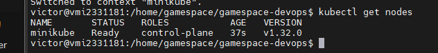
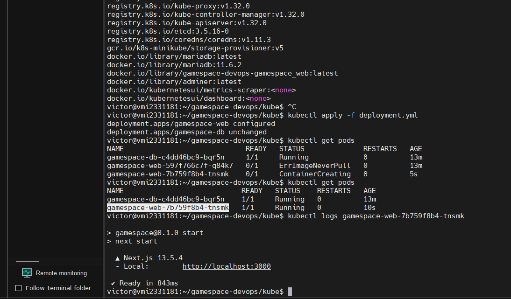
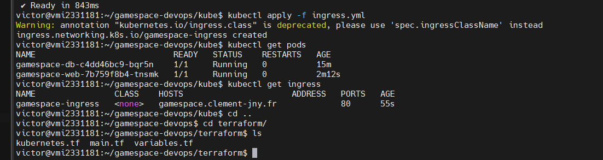
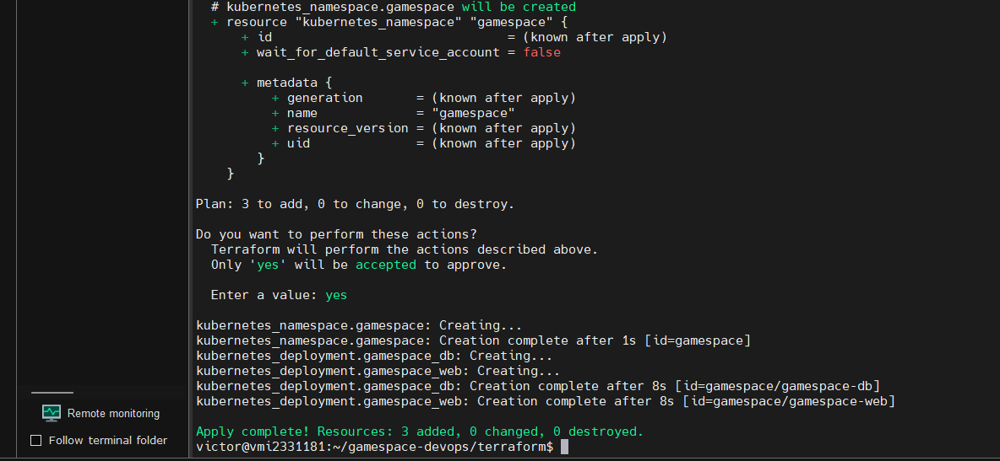

# Gamespace DevOps

## Architecture du projet

Le projet Gamespace est structuré comme suit :

-   **Frontend** / **Backend** : Réalisé avec NextJS
-   **Base de données** : Utilise Prisma pour l'ORM et MariaDB comme base de données
-   **Docker** : Utilisé pour la conteneurisation des services

## Déployer et utiliser le projet

### Déploiement en environnement de développement

```bash
docker compose -f compose.dev.yml up
```

### Déploiement en environnement de production

```bash
docker compose -f compose.prod.yml up
```

### Seed de la base de données

```bash
docker exec -it gamespace_web bash
npx prisma db push
npx prisma db seed
```

## Tâches effectuées par chaque membre du groupe

-   **Clément** : Mise en place du vps
-   **Victor** : Mise en place de Kubernetes et MiniKube
-   **Ertan** : Mise en place de Terraform
-   **Hugo** : Création du Dockerfile et des composes

## Images








